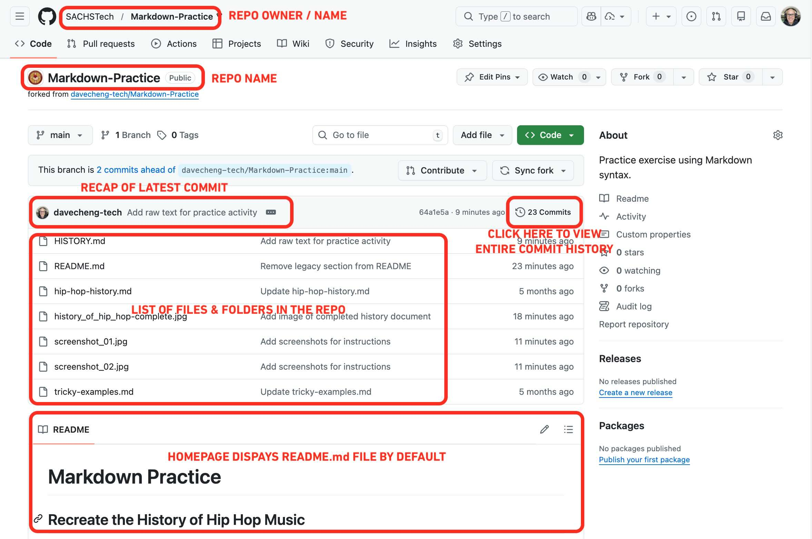
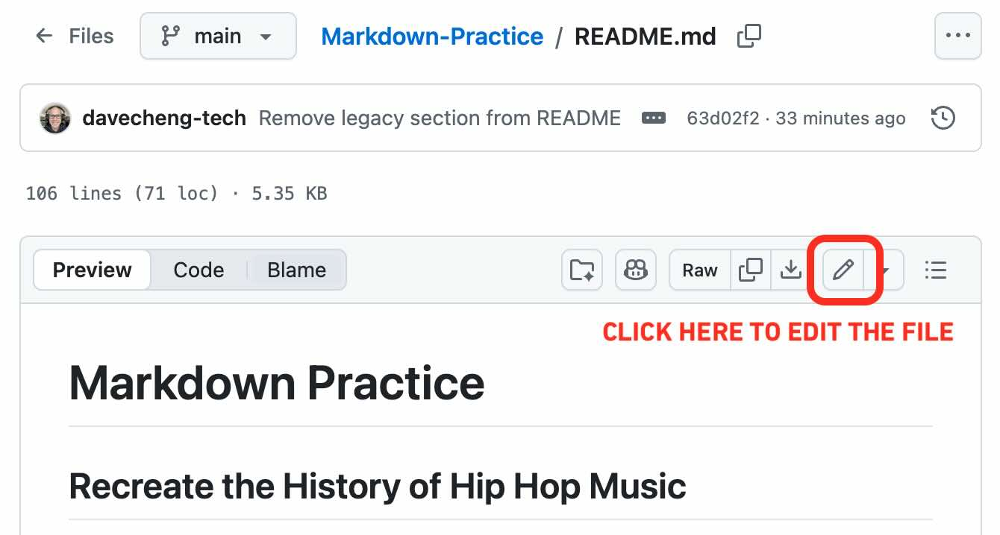
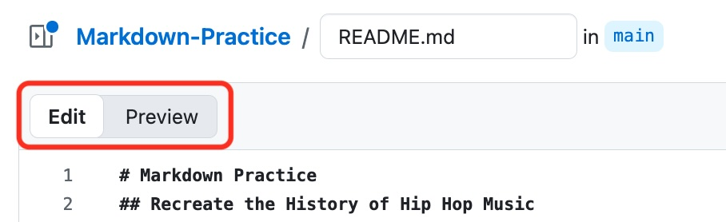
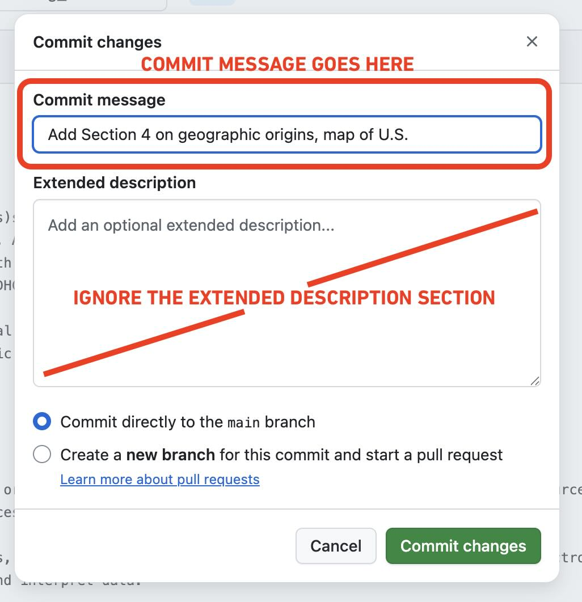

# GitHub Tour & Markdown Practice
Familiarize yourself with GitHub and Markdown syntax with this practice assignment.

## The GitHub Homepage
When you open a repository (repo) on GitHub, you'll be first greeted by the repo's homepage:

Note a few of the key areas in the screenshot above.

 

## Using the GitHub Markdown Editor
Click on any of the files in the file listing to preview, open, or edit it. For Markdown files (usually identified by their `.md` file extension) you can use GitHub's build-in Markdown editor, allowing you to make changes to repo files right in the web browser:

Toggle between the **Edit** and **Preview** tabs to check your work:

 

## Committing Changes
Make sure to **commit changes** at logical stages, such as when a particular section is completed. Write an informative **commit message** about what changes were made. You can leave the extended description blank.

 

# Your Assignment
There are two files for you to try formatting using Markdown. Both of these `.md` files contain all of the raw text (content) already. Refer to the screenshot and apply Markdown formatting syntax.

## Recreate the History of Hip Hop Music
Add formatting, links, and tables to the raw text found in the [HISTORY.md](HISTORY.md) file. It is meant to look a Wikipedia-style reference on the history of hip hop music.

For links to external images and videos, you can use the URLs provided in the text.

A screenshot of the formatted version can be found [here](screenshot_00-history_complete.jpg). 

Edit and commit your changes directly to the `HISTORY.md` file.  

## Additional Challenge
If you finish the hip hop text early, try this additional challenge.

This file [CHALLENGE.md](CHALLENGE.md) contains the raw text. 

Can you make this text look like the formatted screenshot shown [here](screenshot_00-challenge.jpg)? Pay attention to subtle details, such as `monospaced` or `code` text, as well as list indent levels!
